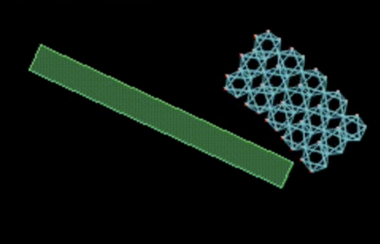

# SoftBodies
Python implementation of soft body modelling paradigms.

## Voxel-based soft body
<video autoplay="autoplay" loop="loop" width="400" height="300">
  <source src="./img/voxel.mp4" type="video/mp4" />
</video>

## Pressure-based soft body
<video autoplay="autoplay" loop="loop" width="400" height="300">
  <source src="./img/pressure.mp4" type="video/mp4" />
</video>

## Tensegrity-based soft body
<video autoplay="autoplay" loop="loop" width="400" height="300">
  <source src="./img/tensegrity.mp4" type="video/mp4" />
  
</video>
